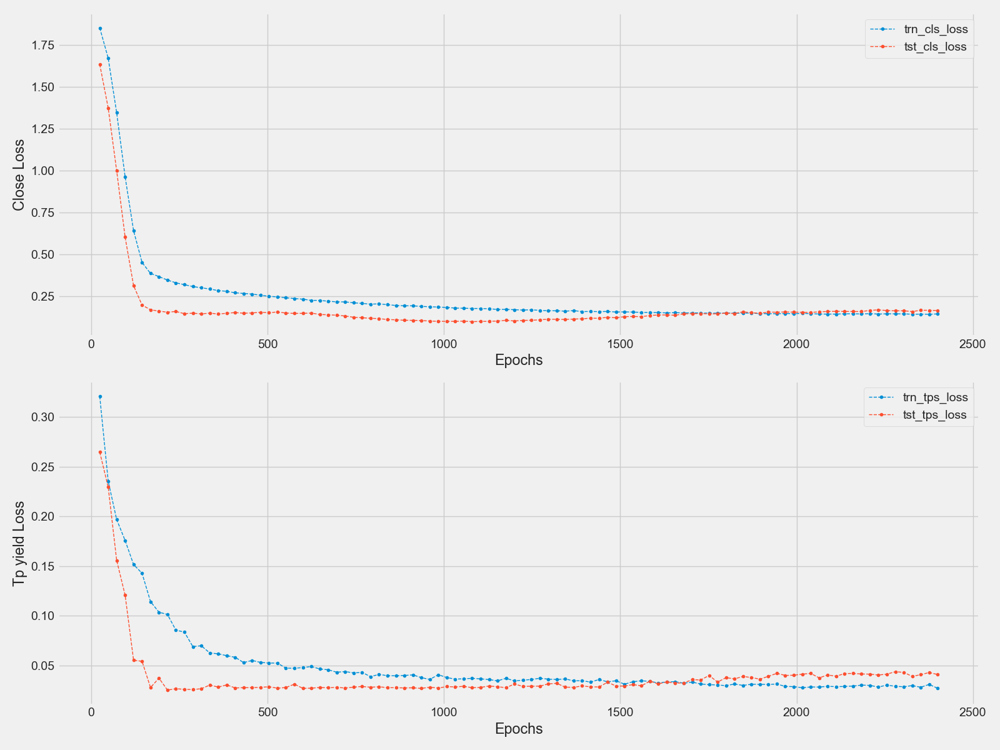

# Quantitative Deep Learning Suite

## Overview
This repository hosts experimental deep learning architectures for financial time-series forecasting. The models combine LSTM and Transformer backbones with attention mechanisms and engineered technical indicators.
Beyond the prediction of pricec and probabilities, the framework integrates backtested trading strategies that evaluate:

- **Risk-Adjusted Performance:** Sharpe ratio analysis

- **Downside Risk Assessment:** Maximum drawdown calculation  

- **Return Analysis:** Total yield (cumulative return) across different time horizons

These metrics allow not only inspection of model fit (losses, predictions, attention maps) but also assessment of practical trading performance over rolling windows.

## Quick Start
Clone the repository and install dependencies:
```bash
git clone https://github.com/<your-username>/<your-repo>.git
cd <your-repo>
pip install -r requirements
```
Run an example (choose a model family):
Transformer:
```
    python transformer/TST_run_.py
```   
LSTM:
```
    python LSTM/LSTM_run_.py
```
To change the stock ticker (e.g. AAPL, MSFT, TSLA), edit the corresponding `.py` file and modify the ticker symbol inside the code. The default ticker is 'AMD'.

Results over a forecast horizon include plots of predicted prices, profit-taking returns, and quantile-binned profit-taking probabilities. Training losses and attention weights are also plotted for quality control.

One can compare the results from:
- `TST_v0p95.py` (self-attention MHA, take-profit returns)  
- `LSTM_attention_v2p5.py` (LSTM simple dot-product attention) 
- `LSTM_v1.py` (pure LSTM)

Parameters can be adjusted directly in the scripts (about 30-40 parameters), such as:
- `pred_len` prediction horizon (e.g. 40 days)  
- `seq_len` training data sequence length  
- `seed` random seed    

For detailed explanations of each version and design change, see the README files inside the `LSTM/` and `transformer/` subfolders.
## Results
Representative outputs from the models are shown below.

**Transformer (TST_v0p95 & TST_v0p8)**  
  
  
  

## Directory 
```
├── LSTM/
|   ├── LSTM_run_.py
│   ├── attention/
│   │   ├── LSTM_attention_v0.py
│   │   ├── LSTM_attention_v1.py
│   │   ├── LSTM_attention_v2.py
│   │   ├── LSTM_attention_v2p5.py
│   │   ├── LSTM_attention_v3.py
│   │   ├── LSTM_attention_v4p5.py
│   │   └── readme.md                
│   └── baseline/
│       ├── LSTM_v0.py
│       ├── LSTM_v0p5.py
│       ├── LSTM_v0p6.py
│       ├── LSTM_v1.py
│       └── readme.md               
│
├── transformer/
│   ├── TST_v0.py
│   ├── TST_v0p1.py
│   ├── TST_v0p5.py
│   ├── TST_v0p8.py
|   ├── TST_v0p81.py
│   ├── TST_v0p95.py
|   ├── TST_run_.py
|   ├── TST_run_yr_yield.py
|   ├── cal_sharpe.py
│   └── readme.md                   
│
├── LICENSE
├── README.md                     
└── requirements.txt
```

## Documentation
- [LSTM/attention/readme.md](./LSTM/attention/readme.md) — details for attention-based LSTM  
- [LSTM/baseline/readme.md](./LSTM/baseline/readme.md) — details for baseline LSTM  
- [transformer/readme.md](./transformer/readme.md) — details for Transformer models           

## License
This project is released under the MIT License. See [LICENSE](./LICENSE) for details
